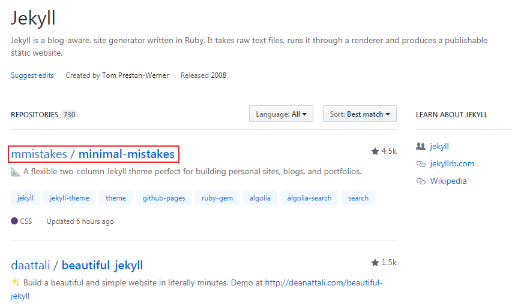
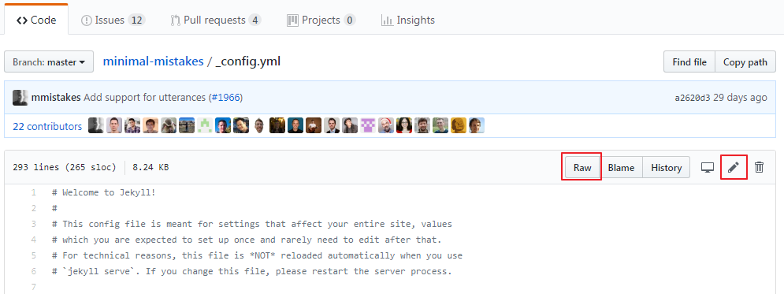
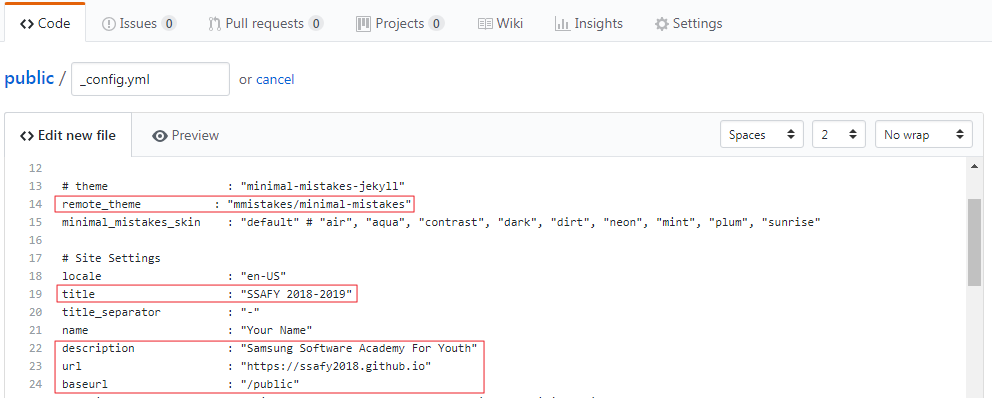
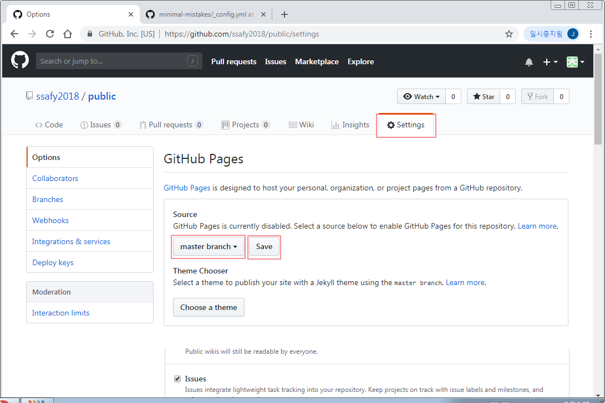
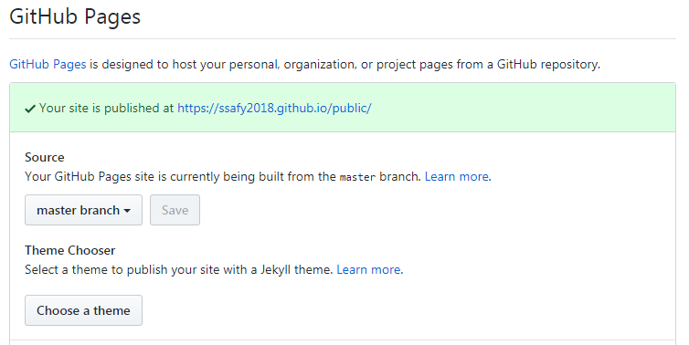

GitHub는 Page 기능을 제공하는데, Jekyll과 같은 테마를 적용해 이를 블로그처럼 활용할 수 있습니다.
덕분에 GitHub가 코드 관리뿐만 아니라 기술 블로그나 포트폴리오로 사용되는 경우도 적잖게 볼 수 있습니다.

* 아래 주소에 접속하여 마음에 드는 테마를 선택합니다.
  - https://github.com/topics/jekyll-theme
  - 테마마다 설정 방법이 조금씩 상이하므로 편의상 첫 번째 나오는 mmistakes / minimal-mistakes를 권장합니다.

  {: width="600px"}
  

* _config.yml 파일을 찾아 클릭합니다.

  {: width="600px"}
  
  
* [Raw] 버튼 또는 연필 아이콘을 클릭해서 문서의 내용을 복사합니다.

  {: width="600px"}
  
  
* 자신의 Repository로 돌아와 [Create new file]을 클릭합니다.

  {: width="600px"}
  
  
* 파일명을 \_config.yml로 하고 본문에 복사한 내용을 붙여 넣습니다.
* 단, 내용 중 일부는 현재 환경에 맞게 변경해야 하므로 아래 항목을 수정합니다.
  ```
  remote_theme             : "mmistakes/minimal-mistakes"
  title                    : "팀명"
  description              : "한 줄 소개"
  url                      : "https://사용자명.github.io" \# 예: https://ssafy2018.github.io"
  baseurl                  : "Repository명" \# "public"
  ```
  
  {: width="600px"}


* 블로그의 시작 페이지 역할을 할 index 파일을 만들고 layout 값을 적어 [Commit]합니다.
  ```
  ---
  layout: home
  ---
  ```
  
  {: width="600px"}
  
  
* Settings에서 Pages를 활성화합니다.

  {: width="600px"}
  

* 잠시 기다리면 Setting에 접속 가능한 주소가 나타나고 웹 브라우저에서 해당 페이지가 열립니다.

  {: width="600px"}
  

*이제 블로그 기본 설정이 끝났습니다!*
