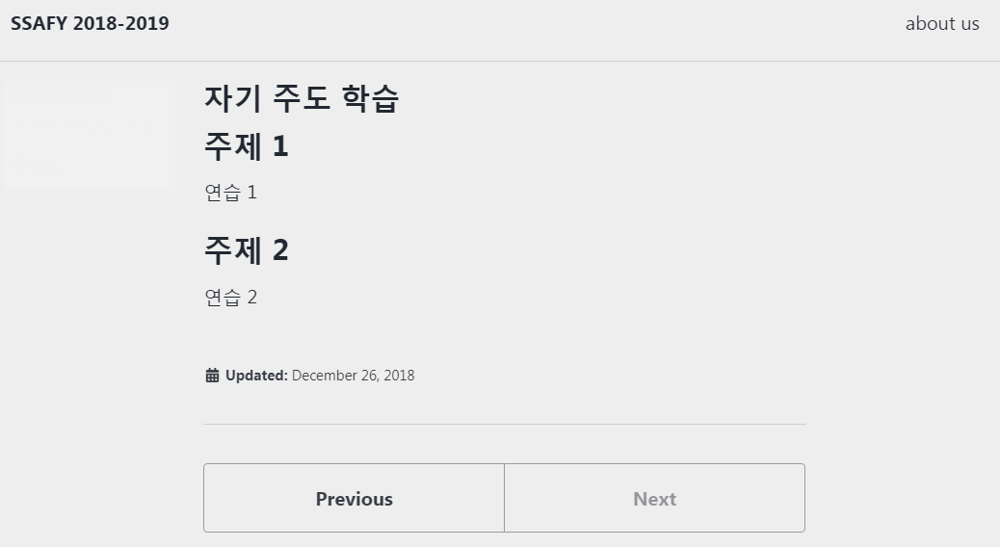

GitHub에 생성한 블로그는 Jekyll 테마에 의해 포스트 등이 자동 반영되어 나타납니다.
단, md 파일로 만들어야 한다는 점과 경로, 파일명이 규칙에 맞게 되어 있어야 하는 점에 주의해야 합니다.

* [Create new file]을 클릭합니다.

  {: width="600px"}


* 파일명을 \_data/navagation.yml으로 입력하고 내용을 아래와 같이 작성합니다.

```
main:
- title: about us
  url: *GitPitch경로*
```
  
  {: width="600px"}

    
*  블로그 주소로 접속하면 상단에 about us라는 버튼이 보이며, 클릭하면 GitPitch URL로 이동합니다.

  {: width="600px"}


* 이번에는 [Create new file]을 클릭하고 아래 내용으로 _posts/2018-12-26-First-Post.md 파일을 생성합니다.
  ```
  ---
  title: 자기 주도 학습
  ---

  # 주제 1

  연습

  * 주제 2

  연습 2
  ```

  {: width="600px"}


*  블로그 주소로 접속하면 \_posts 폴더 내의 포스팅된 글들의 제목이 나타납니다.

  {: width="600px"}


* 문서 제목들이 클릭해서 내용을 살펴 봅시다.

  {: width="600px"}


*이제, 테마와 마크다운을 활용해 블로그의 디자인, 포스팅을 만들어 나갈 수 있습니다.*

